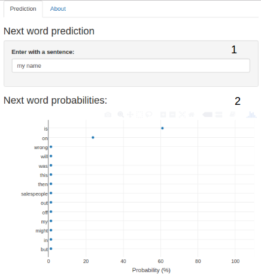

```{r setup, include=FALSE}
knitr::opts_chunk$set(echo = FALSE)
```

## Introduction

Around the world, people are spending an increasing amount of time on their mobile devices for email, social networking, banking and the whole range of other activities. But typing on mobile devices can be a serious pain. This project builds a smart algorithm that can suggest for people the next word of a phrase, for example if someone type: *I went to the* the keyboard presents three options for what the next word might be. For example, the three words might be *gym*, *store*, *restaurant*.

### Goal

Using the dataset provided by SwiftKey, build an app that predict the next word of a phrase. 

This project was developed to the last task of the data science specialization of Johns Hopkins University in the Coursera.

## Algorithm

The algorithm is composed in 6 parts:

1. Downloaded and sampled 1% of the dataset from [Swiftkey](https://d396qusza40orc.cloudfront.net/dsscapstone/dataset/Coursera-SwiftKey.zip) of the datasets twitter, blogs and news in the english language to the training set.
2. Organized the training dataset, removed non english phrases, punctuation and numbers, was stripped the white spaces and the content was passed to lower case.
3. Was generated a [tetra-gram](https://en.wikipedia.org/wiki/N-gram) of the phrases and their frequencies.
4. Was generated a model combining the words of the tetra-grams in the following groupers: word1word2word3, word2word3, word3, word1word3, word1word2, word1, word2 and word4.
5. Was calculated the [Simple Good Turing (SGT)](http://www.grsampson.net/RGoodTur.html) probabilitie to the frequencie of frequencie of the words combinations, 
6. Was executed a validation test to get the accuracy the algorithm using 0.01% of the words for each dataset.

## Usage

The webapp for word prediction is available at [WordPrediction App](https://schmittjoaopedro.shinyapps.io/WordPredicting/), this app receives any phrase (1) and calculates the probability for the next possible words (2).



## Experience

The predictions from the app are very concise for very common cases, but in the specific cases the words found would not be the right choices. A very common example: if I writte "my name" the next word predicted will be "is" that is correct in the most case, but if I write "today i will buy a" the word "book" could not be my next choice.

### Considerations

The algorithm available at [WordPrediction Code](https://github.com/schmittjoaopedro/data-science-capstone/) shows very organised and with the use of the standard libraries, was did a huge research in a various articles, books and examples to found a good mixed of strategies that could be used to build a good algorithm, the accuracy achieved was a mean of 20% in twitter, news and blogs.

